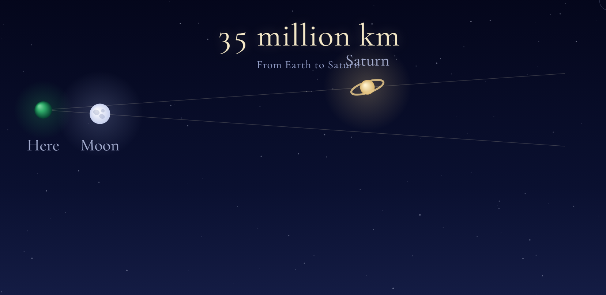

2026年の中秋の名月は9月25日ですが、月の天文学的意味での満月は27日です。

この日は、月が土星に近づいて見えます。中秋の名月を楽しまれた方は、月がより土星に近づいていることがわかるでしょう。0.4等級の明るさの土星でも、満月のそばでは目立たないかもしれません。

（参照）暦計算室ウェブサイト ：「今日のほしぞら 」
https://www.google.com/url?sa=t&source=web&rct=j&opi=89978449&url=https://eco.mtk.nao.ac.jp/cgi-bin/koyomi/skymap.cgi&ved=2ahUKEwjv5MCnkYuXAxUbUOsIHcI8IpEQFnoECB0QAQ&usg=AOvVaw1MFYaPysIjmNjjaNzO7Nxi
では、代表的な都市の星空の様子（惑星や星座の見え方）を簡単に調べることができます。

